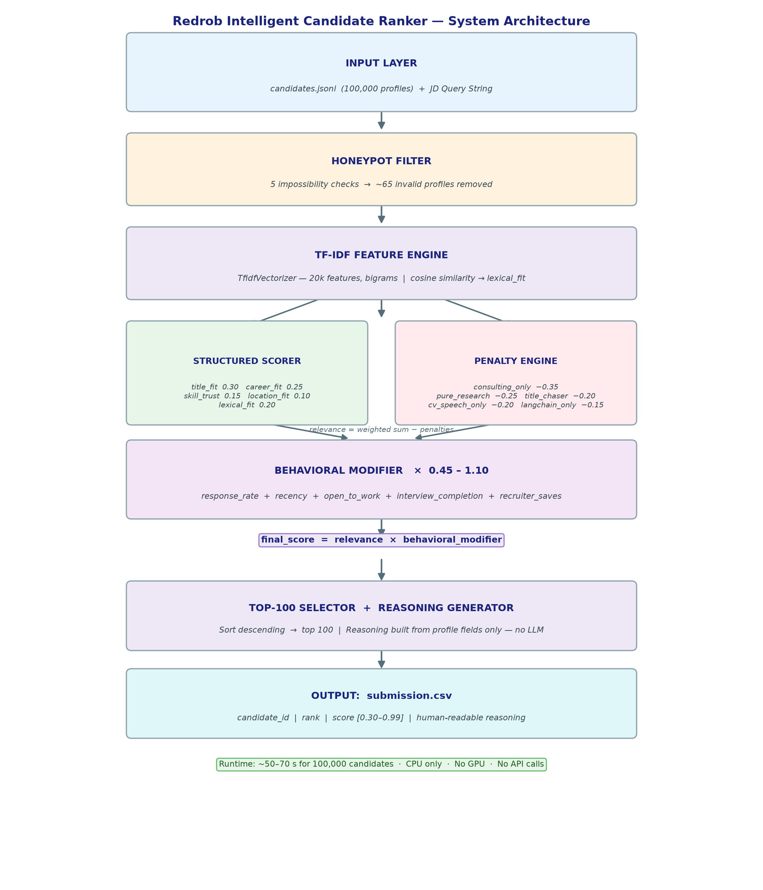

# Redrob Intelligent Candidate Ranker

> **Hackathon Submission** — Ranks the top 100 candidates from a 100,000-candidate pool for the *Senior AI Engineer (Founding Team)* job description. CPU-only · No network · Runs in under 5 minutes.

---

## Overview

Most AI hiring tools default to keyword matching. This ranker doesn't. The job description was explicitly engineered to defeat that approach — it says so in plain English. So instead of counting AI buzzwords, this system is a **faithful encoding of the JD's stated preferences**: what the role actually requires, what signals hiring intent, and what disqualifies a candidate regardless of how impressive their skill list looks.

The result is a transparent, deterministic, fully reproducible ranker that runs on a CPU laptop with zero external API calls.

---

## Architecture



```
final_score = relevance × behavioral_modifier
```

**Relevance** is a weighted sum of five components:

| Component | Weight | What it captures |
|---|---|---|
| `title_fit` | 0.30 | Is this person actually an ML/AI/IR engineer? The primary anti-keyword-stuffer signal. |
| `career_fit` | 0.25 | Did they build retrieval / ranking / recsys systems at a product company? |
| `lexical_fit` | 0.20 | TF-IDF cosine similarity between the JD query and the candidate's full profile text. |
| `skill_trust` | 0.15 | JD-relevant skills weighted by endorsements × usage duration. Kills 0-duration stuffing. |
| `location_fit` | 0.10 | India Tier-1 cities preferred; relocation considered; no visa sponsorship. |

**Penalties** (subtracted pre-modifier) encode the JD's explicit disqualifiers:

| Penalty | Deduction | Trigger |
|---|---|---|
| `consulting_only` | −0.35 | Entire career at services firms (TCS, Infosys, Wipro, etc.) |
| `pure_research` | −0.25 | PhD-only profile with no production deployment language |
| `title_chaser` | −0.20 | Average tenure < 18 months across ≥4 jobs |
| `cv_speech_only` | −0.20 | CV / speech / robotics background with no NLP or IR exposure |
| `langchain_only` | −0.15 | Only recent LLM-wrapper work, no pre-LLM ML foundation |

**Behavioral modifier** (multiplier `~0.45–1.10`) captures real-world hireability: a perfect-on-paper candidate who is dormant for 6 months with a 5% response rate is not actually hireable.

**Honeypots** are removed entirely before ranking via consistency checks in `honeypot.py`.

---

## Quickstart

```bash
# Install dependencies
pip install -r requirements.txt

# Run the ranker
python rank.py --candidates ./candidates.jsonl --out ./submission.csv

# Validate the output
python validate_submission.py submission.csv
# Expected: "Submission is valid."
```

**Runtime:** ~50–70 seconds for 100,000 candidates on a CPU laptop. No GPU. No API calls.

---

## Repository Structure

```
.
├── rank.py                   # Core ranker — scoring pipeline
├── honeypot.py               # Impossible-profile detector (consistency checks)
├── evaluate.py               # Offline metrics: NDCG@10/@50, MAP, P@10, P@5
├── build_labeling_set.py     # Builds a stratified sample for hand-labeling
├── show_candidate.py         # Pretty-prints a full candidate profile
├── validate_submission.py    # Validates submission.csv format & constraints
├── submission.csv            # Final ranked output (top 100)
├── submission_metadata.yaml  # Hackathon submission metadata
├── METHODOLOGY.md            # Detailed methodology (slide deck source)
├── requirements.txt          # Python dependencies
└── .gitignore
```

---

## How to Improve the Ranker

Follow this loop to tune weights with a real gold set:

```bash
# Step 1 — Build a stratified sample to label
python build_labeling_set.py
# Opens label_these.csv — label the `tier` column (3/2/1/0)
# Use show_candidate.py to read profiles; label INDEPENDENTLY of the ranker's order

# Step 2 — Convert labels to gold format
python build_labeling_set.py --to-gold label_these.csv > gold_labels.json

# Step 3 — Evaluate your current ranker
python evaluate.py --submission submission.csv --gold gold_labels.json

# Step 4 — Tune
# Change ONE value in the WEIGHTS or PENALTY dicts in rank.py
# Re-run rank.py → re-run evaluate.py → keep changes that raise the composite

# Step 5 — Extend honeypot detection
# Add any new impossibility patterns discovered during labeling to honeypot.py
```

---

## Design Decisions

**Why not an LLM re-ranker or dense embeddings?**  
The compute budget bans it. An LLM-per-candidate cannot process 100,000 candidates in under 5 minutes on CPU. Beyond the constraint, a transparent feature ranker is more defensible in a live interview and reproduces deterministically in a clean Docker sandbox.

**Why is `title_fit` the highest-weighted component?**  
The JD's primary trap is keyword stuffing: non-engineering professionals who list every AI tool they've heard of. A non-engineering title is a near-disqualifier regardless of skills. This single signal does more filtering work than any amount of lexical matching.

**Why trust-weight skills?**  
Endorsements + usage duration together eliminate candidates who self-claim expertise with no evidence. A skill listed with 0 endorsements and 0 months used contributes essentially nothing to the score.

---

## Evaluation Metric

Scoring is top-heavy by design:

```
composite = 0.50 × NDCG@10 + 0.30 × NDCG@50 + 0.15 × MAP + 0.05 × P@10
```

Getting the top ~15 candidates right accounts for most of the achievable score.

---

## Requirements

- Python 3.9+
- `numpy >= 1.24`
- `scikit-learn >= 1.3`

---

## License

This project was built as a hackathon submission and is shared for reference purposes.
